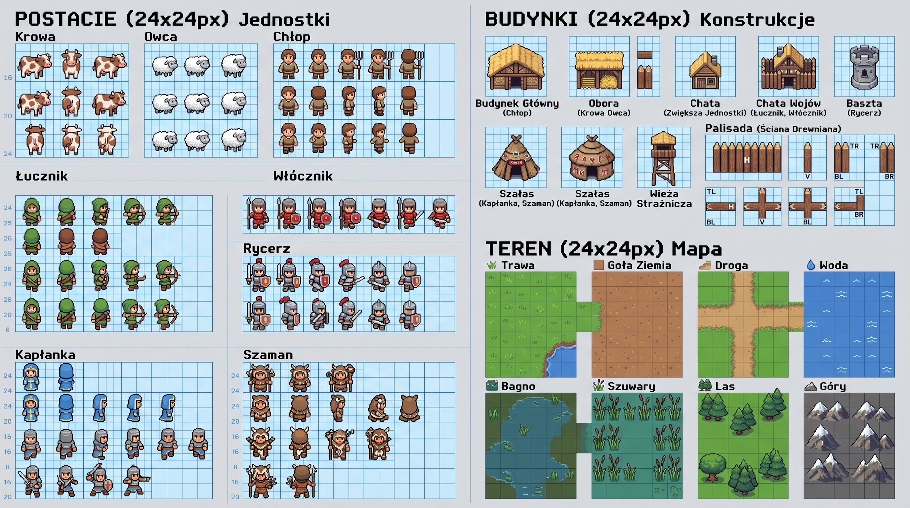

# SŁOWIANIE - Silnik RTS 2D (Hołd dla gry Polanie 1996)



**SŁOWIANIE** to modularny, w 100% natywny silnik strategicznej gry czasu rzeczywistego (RTS 2D) w czystym JavaScript (ES6 Modules) i HTML5 Canvas, inspirowany legendarną polską grą **Polanie** (1996).

---

## 🌟 Główne Funkcjonalności

- 🥛 **Ekonomia Krów i Mleka (Polanie Style)**: Krowy pasą się na łąkach, zjadają trawę i produkują mleko – główny surowiec rekrutacyjny i żywnościowy.
- 🪵 **Wycinka Puszczy**: Kmiecie pozyskują drewno, odsłaniając nowy teren pod osadę.
- 🪙 **Wydobycie Złota & Świątynna Wiara**: Surowce na zaawansowany rynsztunek, konnicę oraz pogańskie czary kapłańskie.
- ⚡ **Magia Kapłańska**: *Grom Peruna*, *Błogosławieństwo Swaroga*, *Zew Watahy*, *Gniew Światowida*.
- 🛡️ **Kampania Fabularna**: „Zjednoczenie Plemion Słowian” z dialogami, posiłkami i zadaniami.
- ⚔️ **Potyczka (Skirmish AI)**: Zróżnicowane profile botów (Zrównoważony, Rasz, Magia, Twierdza).
- 🌐 **Gra Wieloosobowa P2P**: Bezpośrednie połączenia WebRTC za pomocą **PeerJS** oraz matchmaking w sieci **Matrix**.
- 🗺️ **Wbudowany Edytor Map**: Malowanie terenu, zasobów, stad krów i budynków z eksportem JSON i natychmiastowym testowaniem.
- 📜 **Edytor Kampanii & Studio Skryptów AI**: Tworzenie własnych misji i reguł behawioralnych jednostek.
- 🎵 **Proceduralne Audio**: Web Audio API – synteza dźwięków walki, muczenia krów oraz słowiańskiej muzyki folkowej.

---

## 🚀 Uruchomienie

Wystarczy otworzyć `index.html` w przeglądarce lub uruchomić dowolny serwer statyczny:

```bash
# Opcja 1: Python
python -m http.server 8080

# Opcja 2: Node.js
npx serve .
```

---

## 📜 Licencja
MIT
